<!--
This README describes the package. If you publish this package to pub.dev,
this README's contents appear on the landing page for your package.

For information about how to write a good package README, see the guide for
[writing package pages](https://dart.dev/tools/pub/writing-package-pages).

For general information about developing packages, see the Dart guide for
[creating packages](https://dart.dev/guides/libraries/create-packages)
and the Flutter guide for
[developing packages and plugins](https://flutter.dev/to/develop-packages).
-->

# gradient_containers_plus

<div align="center">
  <kbd>
    
  </kbd>
  <br/>
  <br/>
  <b>Jam Ali Hassan</b>
  <br/>
  <i>Flutter Developer</i>
  <br/>
  <br/>
  
  [](https://github.com/jamalihassan0307)
  [](https://www.linkedin.com/in/jamalihassan0307)
  [](https://jamalihassan0307.github.io/portfolio.github.io)
  <br/>
  [](https://pub.dev/packages/gradient_containers_plus)
  [](https://flutter.dev)
  [](https://opensource.org/licenses/MIT)
</div>

## Overview

A Flutter package that provides beautiful and customizable gradient container templates for your Flutter applications. This package offers pre-designed container widgets with various gradient styles, shadows, and rounded corners to enhance your app's visual appeal.

## Installation

Add this to your package's `pubspec.yaml` file:

```yaml
dependencies:
  gradient_containers_plus: ^1.0.5
```

## Usage Examples

### 1. Vertical Gradient Container
<table>
<tr>
<td>

```dart
VerticalGradientContainer(
  height: 150,
  colors: const [Colors.blue, Colors.purple],
  child: const Center(
    child: Text('Vertical Gradient'),
  ),
)
```

</td>
<td>
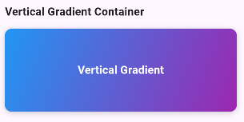
</td>
<td>
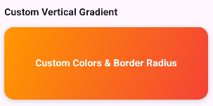
</td>
</tr>
</table>

### 2. Radial Gradient Container
<table>
<tr>
<td>

```dart
RadialGradientContainer(
  height: 150,
  colors: const [Colors.orange, Colors.red],
  radius: 0.85,
  child: const Center(
    child: Text('Radial Gradient'),
  ),
)
```

</td>
<td>
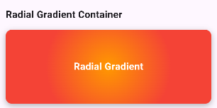
</td>
<td>
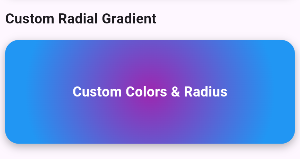
</td>
</tr>
</table>

### 3. Sweep Gradient Container
<table>
<tr>
<td>

```dart
SweepGradientContainer(
  height: 150,
  colors: const [
    Colors.green,
    Colors.teal,
    Colors.blue
  ],
  startAngle: 0,
  endAngle: 2 * 3.14159,
  child: const Center(
    child: Text('Sweep Gradient'),
  ),
)
```

</td>
<td>
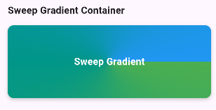
</td>
<td>
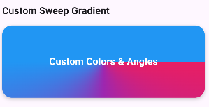
</td>
</tr>
</table>

### 4. Animated Gradient Container
<table>
<tr>
<td>

```dart
AnimatedGradientContainer(
  height: 150,
  colors: const [
    Colors.purple,
    Colors.blue,
    Colors.purple
  ],
  duration: const Duration(seconds: 2),
  child: const Center(
    child: Text('Animated Gradient'),
  ),
)
```

</td>
<td>
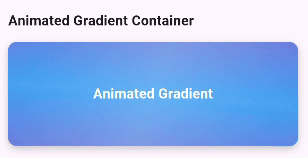
</td>
<td>
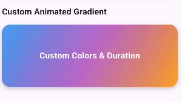
</td>
</tr>
</table>

### 5. Glassmorphic Gradient Container
<table>
<tr>
<td>

```dart
GlassmorphicGradientContainer(
  height: 150,
  colors: const [Colors.white, Colors.white],
  blurSigma: 10,
  borderWidth: 1,
  child: const Center(
    child: Text('Glassmorphic Effect'),
  ),
)
```

</td>
<td>
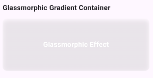
</td>
<td>
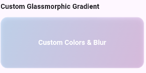
</td>
</tr>
</table>

### 6. Neon Gradient Container
<table>
<tr>
<td>

```dart
NeonGradientContainer(
  height: 150,
  colors: const [
    Color(0xFF00FF87),
    Color(0xFF60EFFF)
  ],
  glowIntensity: 0.5,
  glowSpread: 2,
  child: const Center(
    child: Text('Neon Glow'),
  ),
)
```

</td>
<td>
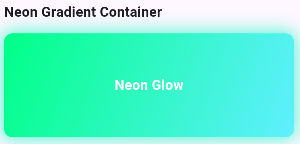
</td>
<td>
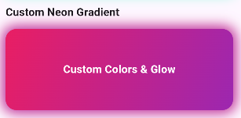
</td>
</tr>
</table>

## Features

✨ 6 pre-designed gradient container templates:
  - 🎨 Vertical Gradient Container with customizable colors and direction
  - 🔄 Radial Gradient Container with adjustable radius and center point
  - 🌈 Sweep Gradient Container with configurable start and end angles
  - ✨ Animated Gradient Container with smooth color transitions
  - 🌟 Glassmorphic Gradient Container with blur and transparency effects
  - 💫 Neon Gradient Container with customizable glow effects

🎯 Additional Features:
- 📱 Responsive design with flexible width and height
- 🎨 Customizable borders, shadows, and corner radius
- 🔌 Easy integration with any Flutter widget
- 📚 Comprehensive documentation and examples
- 💻 Full Platform Support:
  - Android ✓
  - iOS ✓
  - Web ✓
  - Windows ✓
  - macOS ✓
  - Linux ✓

## Customization

Each container can be customized with:
- 🎨 Custom colors and gradients
- 🔲 Border radius and width
- 📐 Container dimensions
- 📏 Padding and margin
- ✨ Specific effects (blur, glow, animation duration)
- 🌗 Shadow properties
- 📍 Child widget positioning

## Documentation

For detailed documentation, please visit our [API Reference](https://pub.dev/documentation/gradient_containers_plus/latest/).

## Additional Information

- 📦 [Pub.dev Package](https://pub.dev/packages/gradient_containers_plus)
- 💻 [GitHub Repository](https://github.com/jamalihassan0307/gradient_containers_plus)
- 🐛 [Issue Tracker](https://github.com/jamalihassan0307/gradient_containers_plus/issues)

## Contributing

We welcome contributions! To contribute:
1. 🍴 Fork the repository
2. 🌿 Create your feature branch
3. ✍️ Commit your changes
4. 🚀 Push to the branch
5. 📬 Create a Pull Request

## License

This project is licensed under the MIT License - see the [LICENSE](LICENSE) file for details.

## Contact

- 👨‍💻 Developed by [Jam Ali Hassan](https://github.com/jamalihassan0307)
- 🌐 [Portfolio](https://jamalihassan0307.github.io/portfolio.github.io)
- 📧 Email: jamalihassan0307@gmail.com
- 🔗 [LinkedIn](https://www.linkedin.com/in/jamalihassan0307)
